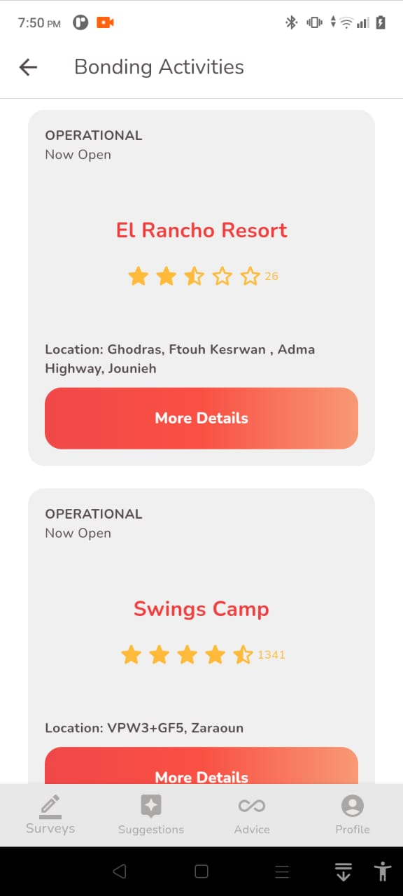
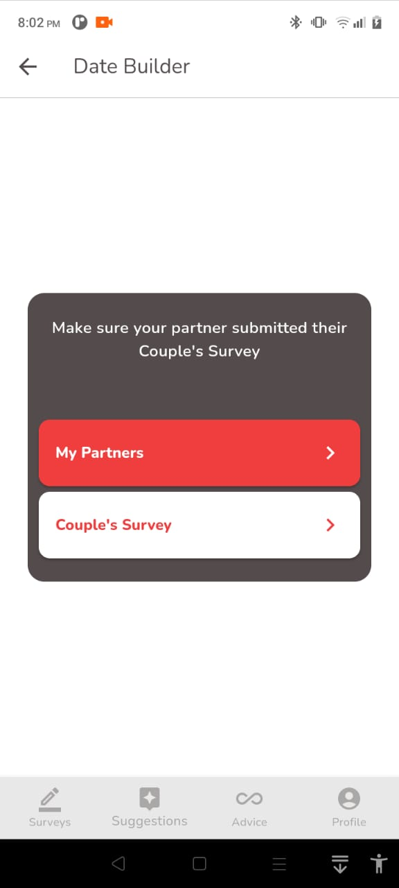
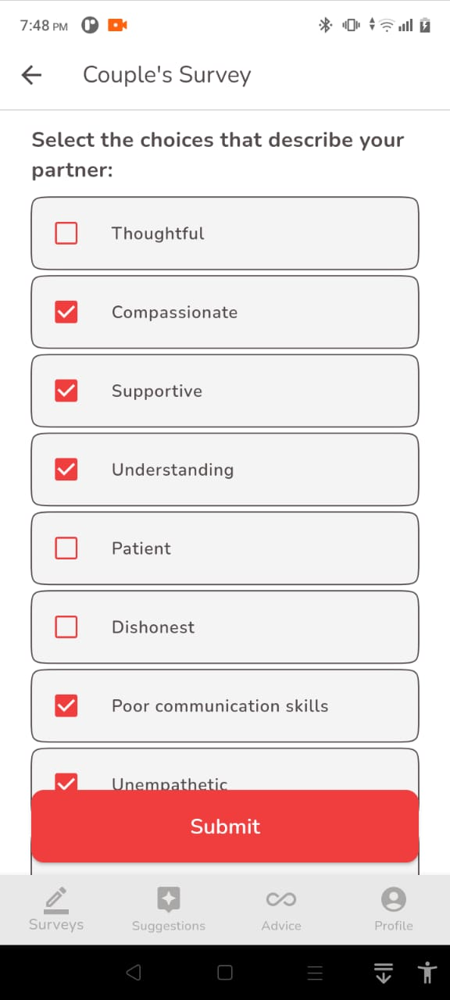
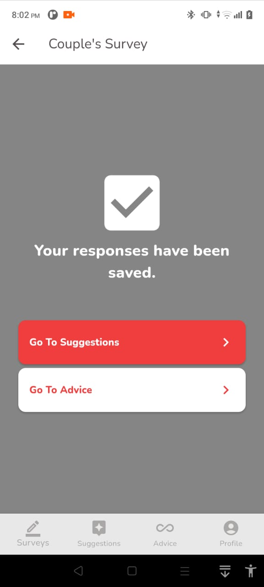
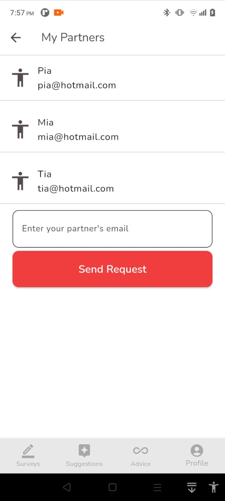
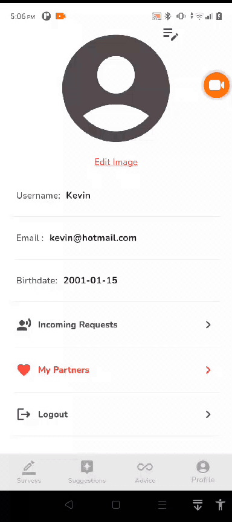

<br><br>

<!-- project philosophy -->


> A mobile app for connecting lovers together and assisting them through a fun and harmonious relationship.
>
> Bound Harmony first requires the users, who probably are in a relationship, to connect their accounts and fill a survey. To make their relationship smoother, Bound Harmony will provide the couple with date suggestions and bonding activities. To make it even better, our cupid will be ready to give advice at any time!

### User Stories

- As a user, I like to spend quality time with my partner. So, I want suggestions for places and activities that suit our interests.
- As a user, I want recommendations for cozy cafes or quiet spots where my partner and I can have meaningful conversations.
- As a user, I want to have access to good relationship and personal advice to help me in my self-development journey.
- As a user, I'd like suggestions for weekend getaways that align me and my partner's shared interests, creating memorable experiences for both of us.
- As a user, I want suggestions for nice and creative gifts, so that I will have a platform for inspiration.
- As a user, I want to explore new hobbies or activities with my partner, so I'm looking for suggestions that join both our interests.
- As a user, I want recommendations for fun and unique date night ideas to keep our relationship exciting.
<br><br>

<!-- Prototyping -->

> I designed Bound Harmony using wireframes and mockups, iterating on the design until I reached the ideal layout for easy navigation and a seamless user experience.
<br><br>

| OnBoarding Screen | Login screen  | Register screen | Setup screen |
| ---| ---| ---| ---|
|  |  |  |  |
| Successful Setup screen | Suggestion screen (Landing) | Date Builder Screen |  Bonding Activities Screen |
|  |  |  |  |
| Suggestions Screen alert 1 | Suggestions Screen alert 2 | Surveys Screen | Personal Survey Screen | 
|  |  |  |  |
| Couples Survey Screen | Personal Survey complete | Couples Survey complete | Advice screen |
|  |  |  |  |
| Profile screen | Incoming Requests alert 1 | Incoming Requests screen | Suggestions Screen alert 2 |
|  |  |  |  |
| My Partners screen (single) | My Partners (in a relationship) | My Partners (single + no history) |
|  |  |  |

<br><br>

<!-- Implementation -->


> Using the wireframes and mockups as a guide, I implemented the Bound Harmony app with it's features. Here is an overview of what the user will have in the app:

### User Screens (Mobile)
| Sign Up | Login-Setup | Profile Customization | 
| --- | --- | --- |
|  |  | 
| Incoming Requests | Personal Survey | Couple's Survey |
|  |  |  | 
| Date Suggestions | Bonding Activities Suggestions | Personalized Advice |
|  |  |  |
| Disconnect from Partner |
|  |

> To keep track of all the inputs coming into the app, the admin page displays a summary of the users' behavior and their responses to each survey. 

### Admin Screens (Web)
| Login screen  | Dashboard Screen |
| ---| ---|
|  |  | 
| Users Screen | Survey Responses |
|  |  |
<br><br>

<!-- Tech stack -->


###  Bound Harmony is built using the following technologies:

- This project uses the [Flutter app development framework](https://flutter.dev/). Flutter is a cross-platform hybrid app development platform which allows us to use a single codebase for apps on mobile, desktop, and the web.
- The admin panel was done using [React.js](https://react.dev/). React.js is a JavaScript library for building user interfaces that enables developers to create interactive and dynamic web applications.
- The backend was handled using [Laravel](https://laravel.com/) and MySql. Laravel is a PHP web application framework that follows the Model-View-Controller (MVC) architectural pattern. Laravel simplifies common tasks such as routing and authentication making it easier for developers to create scalable and maintainable web applications. With features like Eloquent ORM and artisan command-line tools, Laravel facilitates rapid development and supports the creation of modern, feature-rich web applications.
For managing the database schemas and establishing relational connections between tables, I used MySQL, a relational database management system. 
- The app uses openAi in the Advice section. In order to make the advice personalized, survey responses are handled and are summarized before being sent to openAi.
- Google's Google Places Api is used to get the places relative to the user's interests, based on the responses given in the surveys and in relation to the user's partner's interests as well.
- The app uses the font ["Nunito"]([https://fonts.google.com/specimen/Work+Sans]) as its main font, and the design of the app adheres to the material design guidelines.

<br><br>

<!-- How to run -->


> To set up Bound Harmony locally, follow these steps:

### Prerequisites

* npm
  ```sh
  npm install npm@latest -g
  ```

### Installation

1. Clone the repo
   ```sh
   git clone https://github.com/MarcDagher/Bound-Harmony.git
   ```
2. Install Composer
   ```sh
   composer install
   ```
3. Rename your '.env.example' file to '.env'
4. Open your new .env file and make the necessary changes (App name, app key, database name...)
5. Generate an application key:
   ```sh
   php artisan key:generate
   ```
6. Get Migrations
   ```sh
   php artisan migrate
   ```
7. Seed Database
   ```sh
   php artisan db:seed
   ```
8. Install NPM packages
   ```sh
   npm install
   ```
9. Install [Flutter SDK](https://docs.flutter.dev/get-started/install)
10. Go to flutter_app directory
   ```sh
   cd flutter_app
   ```
11. Install pub packages
   ```sh
   flutter pub get
   ```
12. Run flutter_app 
   ```sh
   flutter run
   ```

Now, you should be able to run Bound Harmony locally and explore its features.
