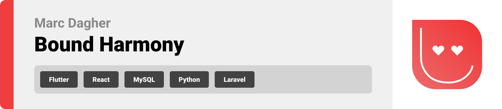
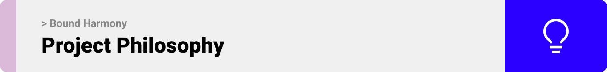
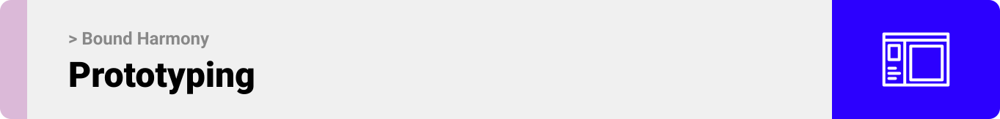
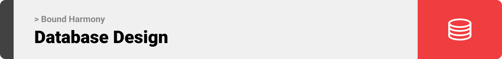

<br><br>

<!-- project philosophy -->


> A mobile app for connecting lovers together and assisting them through a fun and harmonious relationship.
>
> Bound Harmony first requires the users, who probably are in a relationship, to connect their accounts and fill a survey. To make their relationship smoother, Bound Harmony will provide the couple with date suggestions and bonding activities. To make it even better, our cupid will be ready to give advice at any time!

### User Stories

- As a user, I like to spend quality time with my partner. So, I want suggestions for places and activities that suit our interests.
- As a user, I want recommendations for cozy cafes or quiet spots where my partner and I can have meaningful conversations.
- As a user, I want to have access to good relationship and personal advice to help me in my self-development journey.
- As a user, I'd like suggestions for weekend getaways that align me and my partner's shared interests, creating memorable experiences for both of us.
- As a user, I want suggestions for nice and creative gifts, so that I will have a platform for inspiration.
- As a user, I want to explore new hobbies or activities with my partner, so I'm looking for suggestions that join both our interests.
- As a user, I want recommendations for fun and unique date night ideas to keep our relationship exciting.
<br><br>

<!-- Prototyping -->


> I designed Bound Harmony using wireframes and mockups, iterating on the design until I reached the ideal layout for easy navigation and a seamless user experience.

### Wireframes
| Login screen  | Register screen |  Landing screen |
| ---| ---| ---|
|  |  |  |

### Mockups
| Home screen  | Menu Screen | Order Screen |
| ---| ---| ---|
|  |  |  |

<br><br>

<!-- Implementation -->


> Using the wireframes and mockups as a guide, I implemented the Bound Harmony app with the following features:

### User Screens (Mobile)
| OnBoarding Screen | Login screen  | Register screen | Landing screen |
| ---| ---| ---| ---|
|  |  |  |  |
| Home screen  | Menu Screen | Order Screen | Checkout Screen |
|  |  |  |  |

### Admin Screens (Web)
| Login screen  | Register screen |  Landing screen |
| ---| ---| ---|
|  |  |  |
| Home screen  | Menu Screen | Order Screen |
|  |  |  |

<br><br>

<!-- Tech stack -->


###  Bound Harmony is built using the following technologies:

- This project uses the [Flutter app development framework](https://flutter.dev/). Flutter is a cross-platform hybrid app development platform which allows us to use a single codebase for apps on mobile, desktop, and the web.
- For persistent storage (database), the app uses the [Hive](https://hivedb.dev/) package which allows the app to create a custom storage schema and save it to a local database.
- To send local push notifications, the app uses the [flutter_local_notifications](https://pub.dev/packages/flutter_local_notifications) package which supports Android, iOS, and macOS.
  - 🚨 Currently, notifications aren't working on macOS. This is a known issue that we are working to resolve!
- The app uses the font ["Work Sans"](https://fonts.google.com/specimen/Work+Sans) as its main font, and the design of the app adheres to the material design guidelines.

<br><br>

<!-- How to run -->


> To set up Bound Harmony locally, follow these steps:

### Prerequisites

This is an example of how to list things you need to use the software and how to install them.
* npm
  ```sh
  npm install npm@latest -g
  ```

### Installation

_Below is an example of how you can instruct your audience on installing and setting up your app. This template doesn't rely on any external dependencies or services._

1. Get a free API Key at [https://example.com](https://example.com)
2. Clone the repo
   ```sh
   git clone https://github.com/your_username_/Project-Name.git
   ```
3. Install NPM packages
   ```sh
   npm install
   ```
4. Enter your API in `config.js`
   ```js
   const API_KEY = 'ENTER YOUR API';
   ```

Now, you should be able to run Bound Harmony locally and explore its features.
